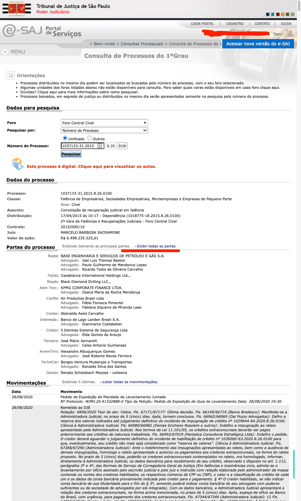

# MAC6967-G6-NLP-juridico

Membros:  
Fabio Yukio  
Pedro Almeida  
Ricardo Tanaka  
Thomas Ferraz  
Verena Saeta  

Atenção: este arquivo será atualizado ao longo do projeto.

## Resumo

O objetivo geral deste projeto é criar algoritmo capaz de extrair informações dos documentos de um processo judicial para obter informações como:
- Fatores não-relacionados às características do processo que podem afetar as decisões dos juízes:
  - Preconceitos étnicos, raciais, de gênero;
  - Experiência do juiz;
  - Opiniões políticas do juiz;
  - Preferências esportivas.
- Mapeamento de como tais fatores podem afetar o resultado do mérito do processo e obter a medida de imparcialidade do Judiciário;
- Existência de variância de decisões dão medida de insegurança jurídica;
- Vieses e parcialidades que possuem consequências sobre o mundo real.

### Etapas

1. ~~Obter amostra de processos judiciais~~;
2. ~~Extrair dados administrativos desses processos~~;
3. ~~Fazer download dos PDFs dos autos desses processos~~;
4. Identificar quem anexou ao processo cada documento;
5. Se o documento foi anexado por advogado, qual das partes é representada pelo advogado;
6. Identificar quais dos documentos são decisões judiciais;
7. Identificar a qua(is) documento(s) cada decisão faz referência;
8. Identificar (na medida do possível) o que está sendo decidido;
9. Identificar quem está sendo afetado pela decisão;
10. Determinar, para cada parte do processo, se cada decisão é favorável, desfavorável ou neutra [-1, +1].

### Input  
- Dados estruturados sobre o processo, extraídos do sistema do TJSP:
  1. Nome do juiz;
  2. Nomes dos advogados;
  3. Nomes das partes do processo;
  4. (...)
  
- PDFs dos autos dos processos:
  1. Petições;
  2. Decisões judiciais;
  3.  (...)
  
### Output
- Para cada decisão judicial de cada processo
  1. Identificar a quais partes a decisão se refere;
  2. Identificar se a decisão é favorável ou desfavorável a essas partes;
  3. Identificar os artigos e leis que são citados na decisão;
  4. Identificar o assunto de que trata a decisão.

### O projeto terá como ponto de partida dois conjuntos de dados:

- **Dataset 1 – dados administrativos dos processos**: base de dados estruturados, com informações (juiz, partes, advogados, vara, comarca, data de início, etc.) para cada um dos milhares de processos de falência e recuperação judicial iniciados em São Paulo entre os anos de 2013 e 2017.
- **Dataset 2 – autos dos processos**: cerca de 200GB a 300GB de PDFs, com a íntegra dos autos dos processos que compõem o dataset 1.

## Dados

Neste projeto trabalharemos com dados de processos judiciais do Tribunal de Justiça de São Paulo (TJSP). Todos os documentos e várias informações de cada processo judicial que hoje tramita no TJSP podem ser acessados por meio do sistema eletrônico do tribunal, o [e-Saj](https://esaj.tjsp.jus.br/). As informações básicas do processo podem ser acessadas por qualquer um, por meio da página de [consulta processual](https://esaj.tjsp.jus.br/cpopg/open.do) do site, desde que se esteja de posse do número do processo. Para ter acesso à integra dos [autos do processo](https://pt.wikipedia.org/wiki/Autos_processuais), contendo todos os seus documentos, é preciso ter credenciais de advogado e fazer a autenticação prévia no site, antes de acessar a página de consulta processual.

Os dados brutos deste projeto são referentes a processos judiciais de falência e de recuperação judicial. Esses dados foram coletados usando uma lista com todos os processos de falência e recuperação judicial iniciados entre 2008 e 2017, enviada no início de 2018 pelo TJSP. A partir dessa lista e das credenciais de um advogado colaborador do projeto, foi criado um algoritmo usando Selenium para acessar o e-Saj; fazer a autenticação; extrair as informações básicas de cada processo, tais como vara, comarca, nome do juiz, nome das partes, advogados habilitados, etc (ver Dataset 1); e fazer o download dos arquivos em PDF dos autos (ver Dataset 2).

### Dataset 1 - Dados Administrativos dos Processos

Cada processo judicial tem uma “página” gerada pelo sistema do TJSP, contendo as informações principais do processo. A figura abaixo traz um exemplo, para o processo de número **1037133-31.2015.8.26.0100**.

Figura 1: Página de uma falência no e-Saj

Para cada número de processo de falência ou recuperação judicial enviado pelo TJSP, foi feito o scrapping da página correspondente a esse número do processo no site do Tribunal. As informações coletadas foram salvas em arquivos RDS. Esses arquivos RDS estão na pasta dataset1, no Google Drive.

### Dataset 2 - Dados Administrativos dos Processos
A figura anterior é referente a um processo de 2015. Os processos judiciais de 2013 em diante são processos digitais (ou eletrônicos), e as suas páginas no site do TJSP contêm o link que permite acesso à integra dos autos processuais, em formato PDF:

Ao clicar neste link, uma nova janela se abre, com todas as páginas dos autos do processo em formato PDF.

Figura 3: Autos de uma falência no e-Saj

Note que apenas este processo tem mais de 68 mil páginas em PDF. A página que está aberta é de uma decisão judicial. Todos esses PDFs foram baixados e esses arquivos estão em um link público do Dropbox.

### Acompanhamento 

Como o volume de dados é bastante grande, sendo inviável de ser baixado para se trabalhar localmente, nesta primeira etapa de tratamento dos dados, utilizaremos o Google Colaboratory para criar códigos que extraiam e leiam os arquivos diretamente na nuvem, sem necessidade de _download_. Dessa forma, esses códigos gerados estarão disponíveis através do Google Drive, mas especificamente, na pasta "Códigos Colab", podendo ser acessado [aqui](faltalink).

Para checar o histórico de edição, basta clicar em "A última edição foi em xx de xxxxx", na barra superior, como na figura 4. 

